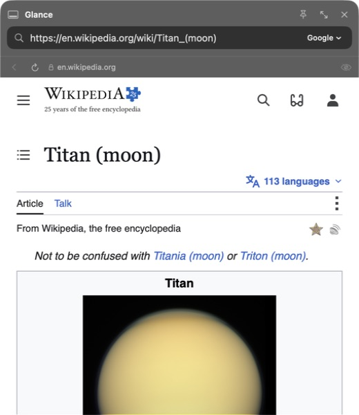

# Web

A small native browser for macOS.



Press `⌃⌥Space` to open **Glance**, search or paste a link, and browse in your screen corner. You can also right-click a link and choose **Open in Glance**. Pin the page while you work, or open it in Web when you need more room. Closing Glance clears its temporary session.

[Walkthroughs](https://github.com/nuance-dev/Web/pull/26) · [What's changed](docs/releases/0.1.0.md) · [Report a bug](https://github.com/nuance-dev/Web/issues) · [Build it](#build)

## Browsing

- Compact native Liquid Glass chrome and a start page with saved pages and recent visits.
- `⌘K` for tabs, commands and search.
- Sidebar, top or hidden tabs; show the address bar or use Focus Mode from View.
- Pin tabs, remove duplicates, and choose whether to restore your session.
- Select a passage and choose **Copy Quote** to copy it with the page link.
- Local AI with MLX, or your own OpenAI, Anthropic or Gemini API key.
- Private tabs with separate temporary storage.

Cloud page sharing is off until you enable it. The assistant can read and summarize; it cannot click, type or submit forms. [AI providers and privacy](docs/ai-providers.md)

## Preview

Web 0.1.0 is a development preview. Local MLX generation and Stop are verified; cloud completions and wider browser compatibility need more testing. [Validation](docs/validation.md) · [Security review](docs/security-audit.md) · [Browser gap](docs/product-direction.md)

## Build

macOS 26.5 or later. Apple Silicon. Xcode 26 with the Metal toolchain.

```sh
git clone https://github.com/nuance-dev/Web.git
cd Web
xcodebuild -downloadComponent MetalToolchain
open Web.xcodeproj
```

Choose your signing team locally, then run the Web scheme. The repository does not include a signing identity. Dependency revisions are pinned.

For a stripped local build, run `./scripts/build-release.sh`. Set `WEB_SIGNING_IDENTITY` to use your own certificate.

```sh
xcodebuild -project Web.xcodeproj -scheme Web \
  -destination 'platform=macOS,arch=arm64' \
  -only-testing:WebTests CODE_SIGNING_ALLOWED=NO test
```

## Shortcuts

| Action | Shortcut |
| --- | --- |
| Glance | `⌃⌥Space` (change in Settings) |
| Commands | `⌘K` |
| New tab | `⌘T` |
| Private tab | `⇧⌘N` |
| Close / reopen tab | `⌘W` / `⇧⌘T` |
| Address | `⌘L` |
| Show / hide address bar | `⇧⌘H` |
| Focus Mode | `⇧⌘B` |
| Find | `⌘F` |
| Bookmark page | `⌘D` |
| Next / previous tab | `⌃Tab` / `⇧⌃Tab` |
| History | `⌘Y` |
| Downloads | `⇧⌘J` |
| Assistant | `⇧⌘A` |

Built with SwiftUI, WebKit and [MLX](https://github.com/ml-explore/mlx-swift). [MIT license](LICENSE).
